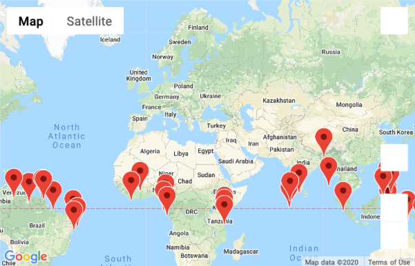
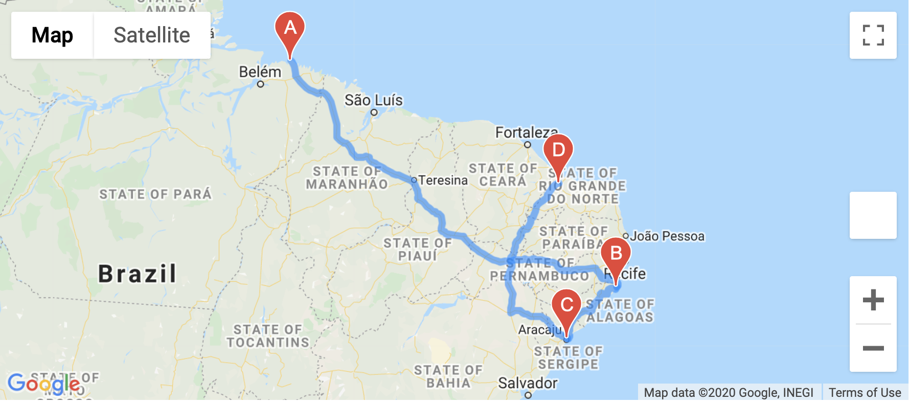
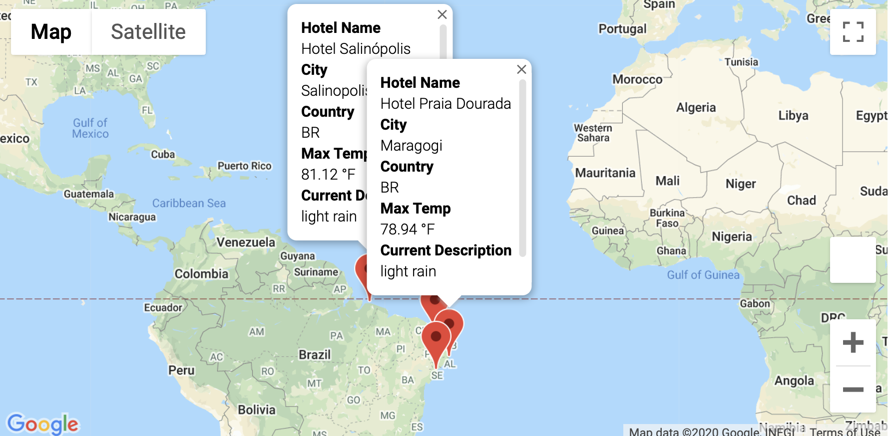

# World_Weather_Analysis

Using Python, Jupyter Notebook, Pandas, Matplotlib and Google APIs to analyse weather data for a travel company, PlanMyTrip.

## Project Overview

For the new modifications to the PlanMyTrip app, you are asked to add more data to the database, or cities DataFrame, so that customers know the weather in the cities when they click on a pop-up marker. You’ll also need to add the amount of rainfall or snowfall within the last three hours so that customers can filter the DataFrame using input statements based on the temperature range and whether or not it is raining or snowing. Finally, you’ll need to create a directions layer Google map that shows the directions between multiple cities for travel.

#### Objectives:

The goals for this challenge are for you to:
1. Use nested try-except blocks.
2. Use Pandas methods and attributes on a DataFrame or Series.
3. Create a new DataFrame from a new API search with new weather parameters.
4. Filter DataFrames based on input and nested decision statements, and logical expressions.
5. Create pop-up markers on a Google map from a filtered DataFrame.
6. Add a directions layer on a Google map between cities in the filtered DataFrame.

## Resources

Data Source : Created by randomly generating Latitudes and Longitudes

Software : Python 3.7.7, Anaconda 2019.07, Conda 4.11.7, Jupyter Notebook, Pandas, Matplotlib. 

## Summary

The two summary dataframes created are:
  - [WeatherPy_Challenge](weather_data/WeatherPy_challenge.csv)
  - [WeatherPy_Vacation](weather_data/WeatherPy_vacation.csv)
  
The three maps created were:

  - WeatherPy Vacation Map
  
  
  
  - WeatherPy Travel Map
  
  
  
  - WeatherPy Travel Map with Markers
  
  
